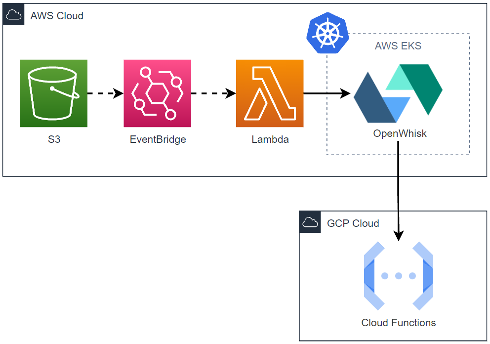
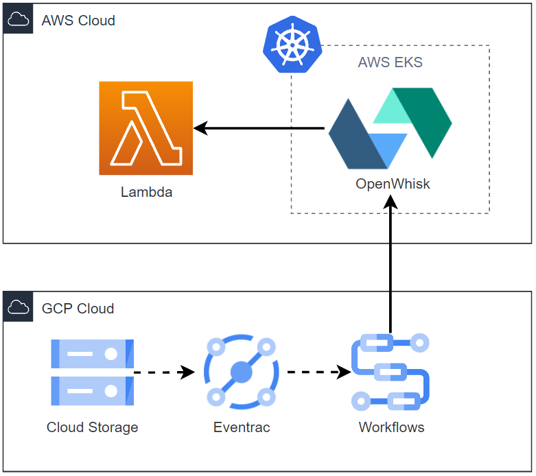

# raise-me
Serverless event broker which allows connecting native cloud events to targets declaratively.
- The native cloud **events** can be raised from either *AWS* or *GCP*.
- The **targets** can be either *HTTP endpoints* or [*OpenWhisk Actions*](https://github.com/apache/openwhisk/blob/master/docs/actions.md).


### Example
Declare your event defintions in `raise-events.yaml`:
```yaml
events:

  s3-to-cloudfunction: # Event's logical name.
    source:
      provider: aws
      filters: # AWS EventBridge event patterns.
        - 'source: ["aws.s3"]'
        - 'detail-type: ["Object Created"]'
        - 'detail: {"bucket": {"name": ["my-bucket-name"]}}'
    targets:
      - http:
          method: post # Sends event data in CloudEvents format.
          url: my-cloudfunction-url
      - action:
          name: my-openwhisk-action-name

  cloudstorage-to-lambda:
    source:
      provider: gcp
      filters: # GCP Eventrac filters.
        - 'type=google.cloud.audit.log.v1.written'
        - 'serviceName=storage.googleapis.com'
        - 'methodName=storage.objects.create'
    targets:
      - http:
          method: get
          url: my-lambda-url
```

---

## Introduction
This solution enables declarative native cloud event routing (e.g. AWS S3's "Object Created") to either HTTP endpoints or user-defined serverless functions deployed as [Apache OpenWhisk](https://openwhisk.apache.org/) Actions.

An example use case could be triggering a [GCP Cloud Function](https://cloud.google.com/functions) when a file is uploaded to an [AWS S3](https://aws.amazon.com/s3/) bucket.
Such process is accomplished by creating necessary cloud resources that will route the event to the OpenWhisk deployment, which will then receive the event's data in the [CloudEvents](https://cloudevents.io/) format and forward it to the Cloud Function through an API call.

---

## Table of Contents
- [Motivation](#motivation)
- [Requirements](#requirements)
- [Configuration](#configuration)
  - [Pulumi](#pulumi)
  - [Enable Google Services](#enable-google-services)
- [Installation](#installation)
- [Testing](#testing)
- [Usage](#usage)
  - [1. Prepare Inputs](#1-prepare-inputs)
  - [2. Create Resources](#2-create-resources)
  - [3. Cleanup](#3-cleanup)
- [Architecture](#architecture)
- [Contriburing](#architecture)
- [License](#architecture)
- [Future Features](#future-features)

---

## Motivation
The implementation alternatives for the previous example (trigger Cloud Function from S3 event) are countless. A straightforward approach could be linking a Lambda to the event, which is fairly simple within the AWS ecosystem, and communicate with the Cloud Function from there.

Although this alternative may seem initially as a good approach, there are several design limitations. If we were to trigger 2 Cloud functions instead of 1, we would have to deploy a new Lambda with code containing logic to reach both Cloud functions.
What if we want to reach 100 endpoints from that single event? Lambdas have a 15-minute time limit on their execution, so extending this event-based communication solution would have limitations in terms of:
- ***Extensibility** – the number of endpoints would be limited by Lambda. Perhaps, we would have to create more Lambdas to handle different endpoints.*
- ***Maintainability** – the logic at the Lambda layer might require frequent changes.*
- ***Complexity** – the logic at the Lambda layer will increase.*
- ***Portability** – this schema would only work for native AWS events, but not for other clouds, such as GCP.*

The solution that **raise-me** provides addresses all of these limitations by using serverless services and an abstraction layer that simplifies the management of the required infrastrcture that makes the event routing possible.

---

## Requirements
- [Apache OpenWhisk](https://openwhisk.apache.org/) deployment - *where the event processors run; OpenWhisk has several [deployment options](https://openwhisk.apache.org/documentation.html#openwhisk_deployment), including Kubernetes.*
- [Pulumi](https://www.pulumi.com/) - *used to create cloud resources.*
- AWS Account & [AWS CLI](https://aws.amazon.com/cli/) - *optional, if AWS events are to be listened.*
- GCP Account - *optional, if GCP events are to be listened.*

---

## Configuration
#### Pulumi
[Configure Pulumi to access your AWS account](https://www.pulumi.com/docs/get-started/aws/begin/) and/or [Google Cloud account](https://www.pulumi.com/docs/get-started/gcp/begin/). If you are just interested in one of those event sources, you can ignore the other.

Create a Pulumi project. You can use either a Python template, AWS or GCP. For example:
```bash
$ mkdir your-project-name
$ pulumi new aws-python
```

Activate your pulumi project's virtual environment and install `raise-me` (available on PyPi):
```bash
$ source ./venv/bin/activate
$ ./venv/bin/python.exe -m pip install raise-me
```

In `Pulumi.<stack-name>.yaml`, make sure you have the appropriate configuration for the corresponding clouds:
```yaml
config:
  aws:region: your-target-region
  gcp:project: your-project-id
```

In your `__main__.py` Pulumi file, include the code that will create the cloud resources for you:
```python
from raise_me.build import CloudBuilder

builder = CloudBuilder(config_path='path/to/raise-config.yaml')
builder.update_stack(events_path='path/to/raise-events.yaml')
```


#### Enable Google Services
Enable the following Google services:
- [Eventrac](https://cloud.google.com/eventarc/docs/overview) - _eventrac triggers will be created._
- [PubSub](https://cloud.google.com/pubsub) - _used internally by Eventrac._
- [Workflows](https://cloud.google.com/workflows) - _workflows will be created._
- [Cloud Logging](https://cloud.google.com/logging) - _provides more event options._

If you are interested in handling events from services that log into Cloud Logging, [enable the logging of those services](https://cloud.google.com/logging/docs/audit/configure-data-access#config-console). 

---

## Installation
Run (available on PyPi):
```bash
$ pip install raise-me
```
Verify installation:
```bash
$ raise --help
```

---

## Testing
Install [Poetry](https://python-poetry.org/) if you don't have it already:
```bash
$ pip install poetry
```

Clone the repository, create a virtual environment at the project level and activate it:
```bash
$ python3 -m venv my-venv
$ source my-venv/bin/activate 
```

Install project dependencies using Poetry:
```bash
$ poetry install
```

Modify the `tests/raise-config.yaml` and provide the connection details of the target OpenWhisk deployment (see [Usage](#usage) for more details). You can also modify the contents of `tests/raise-events.yaml`, but it is not necessary for these tests.

After this, you can run the following integration tests that verify that the connection with the OpenWhisk deployment is successful:
```bash
$ pytest -v -m client # Tests OpenWhisk API client.
$ pytest -v -m paginator # Tests paginator interface using the API client.
$ pytest -v -m builder # Tests creation/destruction of raise-me OpenWhisk resources.
```

---

## Usage

#### 1. Prepare Inputs
There are 2 required inputs, namely `raise-config.yaml` and `raise-events.yaml`.

The `raise-config.yaml` file contains configuration settings that allow connecting to the OpenWhisk deployment and creating cloud resources. *(The auth field in the example contains default values for a basic unchanged OpenWhisk deployment.)*

```yaml
openwhisk:
  namespace: guest # Storage location of Openwhisk resources.
  endpoint: https://my-endpoint:443 # Openwhisk deployment endpoint.
  auth: # Authentication for REST API.
    username: 23bc46b1-71f6-4ed5-8c54-816aa4f8c502
    password: 123zO3xZCLrMN6v2BKK1dXYFpXlPkccOFqm12CdAsMgRU4VrNZ9lyGVCGuMDGIwP

gcp: # Used for cloud resource creation.
  project-id: my-project-id
  region: my-region # Should match pulumi config.
```

The `raise-events.yaml` will contain the event definitions. Each event definition is composed by a Source and a list of Targets.
To specify the desired events, we use each cloud's selection strategy; event patterns for AWS and Eventrac filters for GCP.

```yaml
events:

  s3-to-cloudfunction: # Your event's logical name.
    source:
      provider: aws
      filters: # AWS EventBridge event patterns.
        - 'source: ["aws.s3"]'
        - 'detail-type: ["Object Created"]'
        - 'detail: {"bucket": {"name": ["my-bucket-name"]}}'
    targets:
      - http:
          method: post # Sends event data in CloudEvents format.
          url: my-cloudfunction-url
      - action:
          name: my-openwhisk-action-name

  cloudstorage-to-lambda:
    source:
      provider: gcp
      filters: # GCP Eventrac filters.
        - 'type=google.cloud.audit.log.v1.written'
        - 'serviceName=storage.googleapis.com'
        - 'methodName=storage.objects.create'
    targets:
      - http:
          method: get
          url: my-lambda-url
```

_Notes on the `raise-events.yaml`:_
* _Each event definition must have only 1 `provider` and at least 1 target._
* _The providers available are `aws` and `gcp`._
* _Targets available include `http` and `action`._
* _`http` targets must contain `method` and a `url`. Current available methods are `get` and `post`, where the later sends the event's data to the target._
* _`action` targets must contain the `name` of the OpenWhisk action to trigger, which should be available within the namespace specified in the `raise-config.yaml`._
* _OpenWhisk Actions are language-agnostic, so if you need more advanced event-handling logic, you can deploy your own actions and link them to the one or more events seamlessly!_


#### 2. Create Resources
Once having the inputs ready, we just need to create:
- Cloud resources that will route the events to our OpenWhisk deployment.
- OpenWhisk resources that will handle the incoming events.

Create the OpenWhisk resources using the `raise` command:
```bash
$ raise up --config-path path/to/raise-config.yaml --events-path path/to/raise-events.yaml
```

Create the cloud resources with Pulumi as you usually would:
```bash
~/pulumi/project/$ pulumi up 
```

And done! You should have now the required infrastructure in place to route the specified events to their corresponding targets.


#### 3. Cleanup
To delete the OpenWhisk resources created by **raise-me**, run:
```bash
$ raise destroy --config-path path/to/raise-config.yaml
```

Delete the cloud resources running:
```bash
~/pulumi/project/$ pulumi destroy
```

---

### Architecture
Let's consider the example given in the introduction and an OpenWhisk deployment in [AWS EKS](https://aws.amazon.com/eks/).

To forward S3 events to OpenWhisk, **raise-me** uses [AWS EventBridge](https://aws.amazon.com/eventbridge/). It creates an [EventRule](https://docs.aws.amazon.com/eventbridge/latest/userguide/eb-rules.html) that routes the event to a [Lambda](https://aws.amazon.com/lambda/) function that parses the event and forwards it to the OpenWhisk deployment by firing an [OpenWhisk Trigger](https://github.com/apache/openwhisk/blob/master/docs/triggers_rules.md#creating-triggers-and-rules). Such Trigger will then invoke the necessary Actions to reach the Cloud Function's endpoint.



_Note that:_
- _The services used to route the events to our target, namely *EventBridge*, *Lambda* and *OpenWhisk*, are serverless and can scale seamlessly._
- _The dotted arrows represent AWS managed communication, whereas the solid lines represent REST API calls implemented in the solution._
- _Although OpenWhisk implements internal load balancing, a deployment in EKS will also include an Elastic Load Balancer ([docs](https://github.com/apache/openwhisk-deploy-kube/blob/master/docs/k8s-aws.md)). This component is omitted in the diagram as it is AWS-specific._

Considering the same OpenWhisk deployment, let's say that we would like to trigger a Lambda function when a file is uploaded to a Cloud Storage bucket. The architecture would look as follows:



---

## Contributing
Pull requests are welcome. For major changes, please open an issue first to discuss the change.

Please ensure tests are up to date.

---

## License
[MIT](License)

-----

## Future Features
- [ ] Thorough exception handling
- [ ] Secure OpenWhisk API credentials
  - [ ] AWS: SecretsManager
  - [ ] GCP: SecretManager
- [ ] Http request body/parameters
- [ ] Internal API crendential storage (for HTTP targets)
- [ ] Logging
